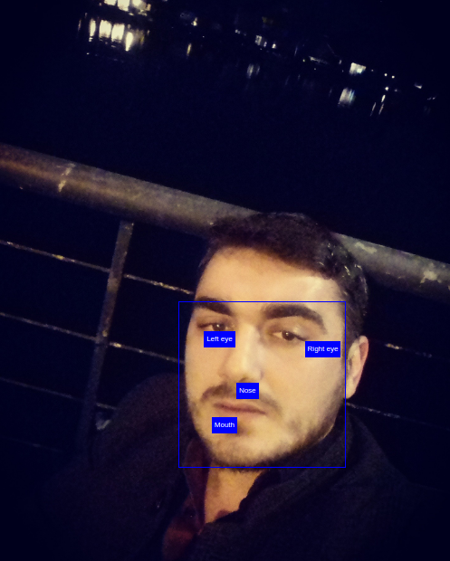

## Face++ JSON to HTML
-----------------------------------------

- Upload your own image to Face++ and get json response about your face.
- Then create new HTML page from scratch.
- Put your image to that page
- Draw rectangle around of your face with div tag, set the height, width, left and top of that div based on information taken from json.
- Put a little divs near to your left and right eyes
- Put a little div near to your nose
- Put a little div near to your mouth

Example:
